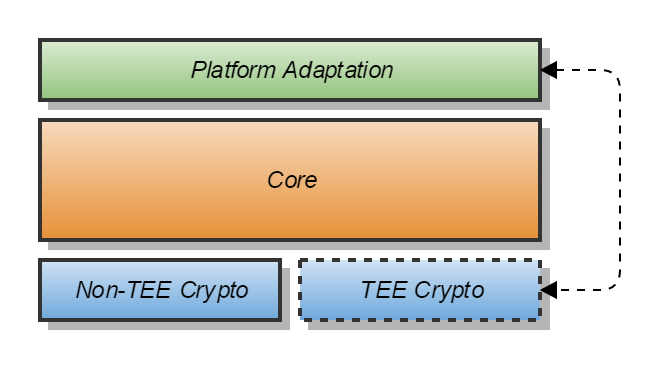
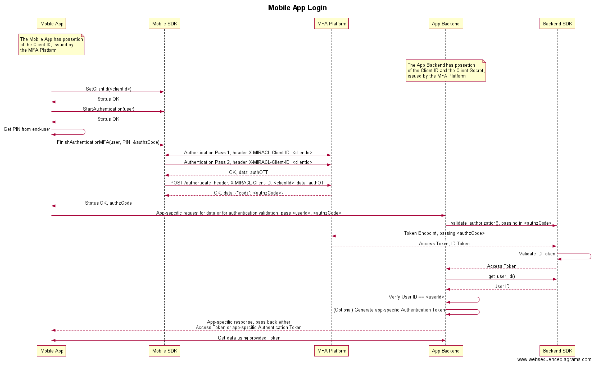
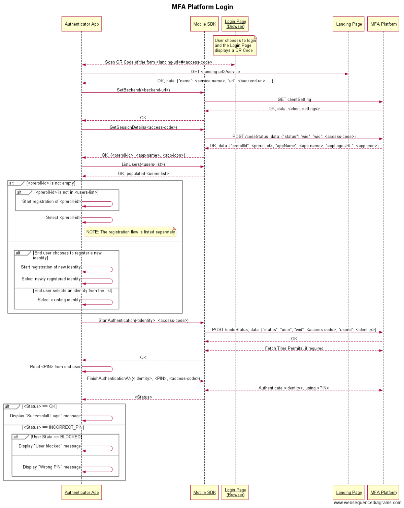

# Apache Milagro Mobile SDK Core

## Architecture and API

### System Overview
The Mobile SDK is a software library that allows mobile application developers to use the Apache Milagro authentication scheme for authenticating their end-users. It is a "native" library which contains native API for each platform:
- Java API for Android
- Objective-C API for iOS
- C# API for Windows Phone.

The SDK implements a Client in the Apache Milagro authentication scheme. It is divided into three layers:
* Crypto
* Core
* Platform Adaptation

#### Crypto

The Crypto layer performs all the cryptographic operations required during the Milagro Registration and Authentication process.
It is currently based on the _Apache Milagro Crypto_ library.
A Trusted Execution Environment (TEE) may be available on some Android platforms (mainly on Samsung devices).
The TEE allows for hardware-secured execution of sensitive code and storage of sensitive data.
The Mobile SDK is designed in such a way that when the TEE is present, the Crypto code might run on it allowing sensitive data to be stored on it.
Thus, two variants of Crypto layer are made available, _Non-TEE Crypto_ and _TEE Crypto_.
They provide the same API towards the Core layer and so should be interchangeable.

The Apache Milagro Crypto is a C library which the Non-TEE Crypto wraps with platform-agnostic C++ code.

#### Core

The Core layer implements the logic and flow of the Apache Milagro Authentication Platform.
It is written in C++ and is platform-agnostic.
As it is not solely able to perform certain tasks, such as storing data on the device, or making HTTP requests, it invokes the _Platform Adaptation_ layer through interfaces provided during the Core initialization, to do them.

#### Platform Adaptation

This layer is implemented separately for every platform, since it is the only platform-specific component in the SDK.
It provides a thin adaptation layer for the Core's C++ API to the native languages, Java, Objective-C or C#, for the different Mobile Platforms.
It also provides platform-specific implementation of Secure and Non-Secure Storage and HTTP Requests.



For the platform-specific API's see:
* [Android SDK API](https://github.com/apache/incubator-milagro-mfa-sdk-android)
* [iOS SDK API](https://github.com/apache/incubator-milagro-mfa-sdk-ios)
* [Windows Phone SDK API](https://github.com/apache/incubator-milagro-mfa-sdk-wp)

### Core API

The Core layer is the central part of the Apache Milagro SDK.
It implements the functionality of a Milagro Client and drives the communication with the Milagro MFA Services.
The SDK Core (and Crypto) are implemented in a portable way, using C/C++ programming languages, to enable them to be compiled for different platforms such as a mobile or a desktop one.
Most of the platforms provide a native API to make HTTP requests and store data.
The Core utilizes the services on the specific platform it was compiled to, and runs on top of them.
Hence, it works with Interfaces for those platform-specific services, as they are implemented at the _Platform Adaptation Layer_.

The interfaces are:

* `IHttpRequest` - for making HTTP requests
* `IStorage`     - for storing data on the device
* `IContext`     - for grouping the rest of the interfaces into a single bundle

Although the SDK Core API (part of it) is the de-facto SDK API, it is not exposed to the application developer.
It is an internal API to the Platform Adaptation Layer, which presents the SDK API to the application in a way that is native to the platform.

#### HTTP Request Interface (`IHttpRequest`)
The Core uses this interface to make HTTP requests.
It should be implemented in the Platform Adaptation Layer.
The Core creates an HTTP Request object via `IContext::CreateHttpRequest()` method and when done, releases the request via `IContext::ReleaseHttpRequest()`.

##### `virtual void SetHeaders(const StringMap& headers);`
This method sets the headers for the HTTP Request.
The headers are passed in the `headers` key/value map, which is a standard `std::map<std::string, std::string>` object.
This method should be called prior to executing the HTTP Request.

##### `virtual void SetQueryParams(const StringMap& queryParams);`
This method sets the query parameters for the HTTP Request.
The query parameters are passed in the `queryParams` key/value map, which is a standard `std::map<std::string, std::string>` object.
This method is called prior to executing the HTTP Request.

##### `virtual void SetContent(const String& data);`
This method sets the content (the data) of the HTTP Request.
It is passed in the `data` parameter as a string.
This method is called prior to executing the HTTP Request.

##### `virtual void SetTimeout(int seconds);`
This method sets a timeout for the HTTP Request.
The timeout is set in `seconds`.
If not set, the timeout is expected to be infinite.
This method is called prior to executing the HTTP Request.

##### `virtual bool Execute(Method method, const String& url);`
This method executes the HTTP Request with the provided `method` and to the given `url`.
The `Method` enumerator is defined as follows:
```c++
enum Method
{
    GET,
    POST,
    PUT,
    DELETE,
    OPTIONS,
    PATCH
};
```
The request is made with the previously set headers, query parameters and data.
If the HTTP request was successfully executed, and a response received, the return value will be `true`.
If the execution failed, the return value would be `false`.

**NOTE** that a non-2xx HTTP response does not mean that the request has failed, but that it succeeded while the return status code was not a 2xx HTTP response.
If the `Execute()` request failed, the `GetExecuteErrorMessage()` will return more information on the reason for the failure.

##### `virtual const String& GetExecuteErrorMessage() const;`
Returns an error message describing the failure of a preceding `Execute()` request.

##### `virtual int GetHttpStatusCode() const;`
Returns the status code received in response to the preceding successfully executed HTTP request.

##### `virtual const StringMap& GetResponseHeaders() const;`
Returns the headers received in response to the preceding successfully executed HTTP request.
The headers are returned in a key/value map, which is a standard `std::map<std::string, std::string>` object.

##### `virtual const String& GetResponseData() const;`
Returns the data received as a response to the preceding successfully executed HTTP request.
The data is returned as a string.

#### Storage Interface (`IStorage`)
The Core uses this interface to store data on the specific platform.
As different platforms provide different storage options, the implementation of the interface should be part of the Platform Adaptation Layer.
There are two kinds of storages that the Core uses, Secure and Non-secure.
In the Secure Storage, the Core stores the _regOTT_ (during registration) and _M-Pin Token_ for every user that is registered through the device.
In the Non-Secure Storage, the Core stores all non-sensitive data, like cached Time Permits.
The `IContext` provides the interface to the correct Storage via the `IContext::GetStorage(IStorage::Type)` method.

##### `virtual bool SetData(const String& data);`
This method sets/writes the whole storage data.
The data is provided in the data parameter, as a string.
The return value is `true` on success or `false` on failure.
If the method fails, further information regarding the error can be obtained through the `GetErrorMessage()` method.

##### `virtual bool GetData(OUT String& data);`
This method gets/reads the whole storage data.
The data is returned in the `data` parameter, as a string.
The return value is `true` on success or `false` on failure.
If the method fails, further information regarding the error can be obtained through the `GetErrorMessage()` method.

##### `virtual const String& GetErrorMessage() const;`
Returns the error from the preceding failed `GetData()` or `SetData()` methods.

#### Context Interface (`IContext`)
The Context Interface "bundles" the rest of the interfaces.
This is the only interface that is provided to the Core where the other interfaces are used/accessed through it.

##### `virtual IHttpRequest* CreateHttpRequest() const;`
This request creates a new HTTP request instance that conforms with `IHttpRequest`, and returns a pointer to it.
The Core calls `CreateHttpRequest()` when it needs to make an HTTP request.
After receiving a pointer to such an instance, the Core sets the needed headers, query parameters and data, and then executes the request.
The Core will then check for the status code, the headers, the data of the response, and will finally release the HTTP request.

**NOTE** that the HTTP request instance should remain "alive" until calling `ReleaseHttpRequest()`.

**NOTE** As the Core might create two or more HTTP request instances in parallel, the implementation should not use global or local (stack) HTTP request objects.

##### `virtual void ReleaseHttpRequest(IN IHttpRequest* request) const;`
This request destroys/releases a previously created HTTP request instance.
The Core calls `CreateHttpRequest()` when it needs to make an HTTP request.
After receiving a pointer to such an instance, the Core sets the needed headers, query parameters and data, and then executes the request.
The Core checks for the status code, the headers, the data of the response, and finally releases the HTTP request.

**NOTE** that the HTTP request instance should remain "alive" until calling `ReleaseHttpRequest()`.

**NOTE** Also, as the Core might create two or more HTTP request instances in parallel, the implementation should not use global or local (stack) HTTP request objects.

##### `virtual IStorage* GetStorage(IStorage::Type type) const;`
This method returns a pointer to the storage implementation, which conforms to `IStorage`.
There are two storage types, Secure and Non-Secure, where you can pass your desired storage type as a parameter.
The `IStorage::Type` enumerator is defined as follows:
```c++
enum Type
{
    SECURE,
    NONSECURE
};
```

##### `virtual CryptoType GetMPinCryptoType() const;`
This method provides information regarding the supported Crypto Type on the specific platform.
Currently, this method could return a different value than Non-TEE Crypto, only on an Android platform.
Other platforms will always return a Non-TEE Crypto value.
On an Android, the Platform Adaptation needs to check if TEE is supported, and then return TEE or Non-TEE Crypto type accordingly.
The `CryptoType` enumerator is defined as follows:
```c++
enum CryptoType
{
    CRYPTO_TEE,
    CRYPTO_NON_TEE
};
```

#### Main Core API (`MPinSDK`)
The `MPinSDK` is the main SDK Core class.
In order to use the Core, one should create an instance of the `MPinSDK` class and initialize it.
Most of the methods return a `MPinSDK::Status` object, which is defined as follows:

```c++
class Status
{
public:
    enum Code
    {
        OK,
        PIN_INPUT_CANCELLED,     // Local error, returned when a user cancels entering a pin
        CRYPTO_ERROR,            // Local error in crypto functions
        STORAGE_ERROR,           // Local storage related error
        NETWORK_ERROR,           // Local error - unable to connect to remote server (no internet, or invalid server/port)
        RESPONSE_PARSE_ERROR,    // Local error - unable to parse json response from remote server (invalid json or unexpected json structure)
        FLOW_ERROR,              // Local error - improper MPinSDK class usage
        IDENTITY_NOT_AUTHORIZED, // Remote error - remote server refuses user registration or authentication
        IDENTITY_NOT_VERIFIED,   // Remote error - remote server refuses user registration because identity is not verified
        REQUEST_EXPIRED,         // Remote error - register/authentication request expired
        REVOKED,                 // Remote error - unable to get time permit (probably the user is temporarily suspended)
        INCORRECT_PIN,           // Remote error - user entered wrong pin
        INCORRECT_ACCESS_NUMBER, // Remote/local error - wrong access number (checksum failed or RPS returned 412)
        HTTP_SERVER_ERROR,       // Remote error, when the error does not apply to any of the above - the remote server returned internal server error status (5xx)
        HTTP_REQUEST_ERROR,      // Remote error, where the error does not apply to any of the above - invalid data sent to server, the remote server returned 4xx error status
        BAD_USER_AGENT,          // Remote error - user agent not supported
        CLIENT_SECRET_EXPIRED    // Remote error - re-registration required because server master secret expired
    };

    Code GetStatusCode() const;
    const String& GetErrorMessage() const;
    bool operator==(Code statusCode) const;
    bool operator!=(Code statusCode) const;
    ...
};
```
The methods that return `Status`, will always return `Status::OK` if successful.
Many methods expect the provided `User` object to be in a certain state, and if it is not, the method will return `Status::FLOW_ERROR`

##### `Status Init(const StringMap& config, IN IContext* ctx);`
##### `Status Init(const StringMap& config, IN IContext* ctx, const StringMap& customHeaders);`
This method initializes the `MPinSDK` instance.
It receives a map of configuration parameters and a pointer to a [Context Interface](#Context-Interface).
The configuration map is a key-value map into which different configuration options can be inserted.
This is a flexible way of passing configurations into the Core, as the method parameters will not change when new configuration parameters are added.
Unsupported parameters will be ignored.
Currently, the Core recognizes the following parameters:

* `backend` - the URL of the Milagro MFA back-end service (Mandatory)
* `rpsPrefix` - the prefix that should be added for requests to the RPS (Optional). The default value is `"rps"`.

The `customHeaders` parameter is optional and allows the caller to pass additional map of custom headers, which will be added to any HTTP request that the SDK executes.

Example:
```c++
MPinSDK::StringMap config;
config["backend"] = "http://ec2-54-77-232-113.eu-west-1.compute.amazonaws.com";
 
MPinSDK* sdk = new MPinSDK;
MPinSDK::Status s = sdk->Init( config, Context::Instance() );
```

##### `void Destroy();`
This method clears the `MPinSDK` instance and releases any allocated data by it.
After calling this method, one should use `Init()` again in order to re-use the `MPinSDK` instance.

##### `void SetClientId(const String& clientId);`
This method will set a specific _Client ID_ which the SDK should use when sending requests to the backend.
As an example, the MIRACL MFA Platform issues _Client IDs_ for registered applications, which use the platform for authenticating users.
When the SDK is used to authenticate users specifically for this registered application, the _Client ID_ should be set by the app using this method. 

##### `Status TestBackend(const String& server, const String& rpsPrefix = "rps") const;`
This method will test whether `server` is a valid back-end URL by trying to retrieve Client Settings from it.
Optionally, a custom RPS prefix might be specified if it was customized at the back-end and is different than the default `"rps"`.
If the back-end URL is a valid one, the method will return `Status::OK`.

##### `Status SetBackend(const String& server, const String& rpsPrefix = "rps");`
This method will change the currently configured back-end in the Core.
Initially the back-end might be set through the `Init()` method, but then it might be change using this method.
`server` is the new back-end URL that should be used.
Optionally, a custom RPS prefix might be specified if it was customized at the back-end and is different than the default `"rps"`.
If successful, the method will return `Status::OK`.

##### `UserPtr MakeNewUser(const String& id, const String& deviceName = "") const;`
This method creates a new `User` object.
The User object represents an end-user of the Milagro authentication.
The user has its own unique identity, which is passed as the id parameter to this method.
Additionally, an optional `deviceName` might be specified.
The _Device Name_ is passed to the RPA, which might store it and use it later to determine which _M-Pin ID_ is associated with this device.
The returned value is of type `UserPtr`, which is a reference counting shared pointer to the newly created `User` instance.
The User class itself looks like this:
```c++
class User
{
public:
    enum State
    {
        INVALID,
        STARTED_REGISTRATION,
        ACTIVATED,
        REGISTERED,
        BLOCKED
    };

    const String& GetId() const;
    const String& GetBackend() const;
    State GetState() const;

private:
    ....
};
```
The newly created user is in the `INVALID` state.
The `User` class is defined in the namespace of the `MPinSDK` class.

##### `void DeleteUser(INOUT UserPtr user);`
This method deletes a user from the users list that the SDK maintains.
All the user data including its _M-Pin ID_, its state and _M-Pin Token_ will be deleted.
A new user with the same identity can be created later with the `MakeNewUser()` method.

##### `Status ListUsers(OUT std::vector<UserPtr>& users) const;`
This method populates the provided vector with all the users that are associated with the currently set backend.
Different users might be in different states, reflecting their registration status.
The method will return `Status::OK` on success and `Status::FLOW_ERROR` if no backend is set through the `Init()` or `SetBackend()` methods.

##### `Status ListUsers(OUT std::vector<UserPtr>& users, const String& backend) const;`
This method populates the provided vector with all the users that are associated with the provided `backend`.
Different users might be in different states, reflecting their registration status.
The method will return `Status::OK` on success and `Status::FLOW_ERROR` if the SDK was not initialized.

##### `Status ListAllUsers(OUT std::vector<UserPtr>& users) const;`
This method populates the provided vector with all the users associated with all the backends know to the SDK.
Different users might be in different states, reflecting their registration status.
The user association to a backend could be retrieved through the `User::GetBackend()` method.
The method will return `Status::OK` on success and `Status::FLOW_ERROR` if the SDK was not initialized.

##### `Status ListBackends(OUT std::vector<String>& backends) const;`
This method will populate the provided vector with all the backends known to the SDK.
The method will return `Status::OK` on success and `Status::FLOW_ERROR` if the SDK was not initialized.

##### `Status GetServiceDetails(const String& url, OUT ServiceDetails& serviceDetails);`
This method is provided for applications working with the _MIRACL MFA Platform_.
After scanning a QR Code from the platform login page, the app should extract the URL from it and call this method to retreive the service details.
The service details include the _backend URL_ which needs to be set back to the SDK in order connect it to the platform.
This method could be called even before the SDK has been initialized, or alternatively the SDK could be initialized without setting a backend, and `SetBackend()` could be used after the backend URL has been retreived through this method.
The returned `ServiceDetails` look as follows:
```c++
class ServiceDetails
{
public:
    String name;
    String backendUrl;
    String rpsPrefix;
    String logoUrl;
};
```
* `name` is the service readable name
* `backendUrl` is the URL of the service backend. This URL has to be set either via the SDK `Init()` method or using  `SetBackend()`
* `rpsPrefix` is RPS prefix setting which is also provided together with `backendUrl` while setting a backend
* `logoUrl` is the URL of the service logo. The logo is a UI element that could be used by the app.

##### `Status GetSessionDetails(const String& accessCode, OUT SessionDetails& sessionDetails);`
This method could be optionally used to retrieve details regarding a browser session when the SDK is used to authenticate users to an online service, such as the _MIRACL MFA Platform_.
In this case an `accessCode` is transferred to the mobile device out-of-band e.g. via scanning a graphical code.
The code is then provided to this method to get the session details.
This method will also notify the backend that the `accessCode` was retrieved from the browser session.
The returned `SessionDetails` look as follows:
```c++
class SessionDetails
{
public:
    void Clear();

    String prerollId;
    String appName;
    String appIconUrl;
};
```
During the online browser session an optional user identity might be provided meaning that this is the user that wants to register/authenticate to the online service.
* The `prerollId` will carry that user ID, or it will be empty if no such ID was provided.
* `appName` is the name of the web application to which the service will authenticate the user.
* `appIconUrl` is the URL from which the icon for web application could be downloaded.

##### `Status StartRegistration(INOUT UserPtr user, const String& activateCode = "", const String& userData = "");`
This method initializes the registration for a User that has already been created.
The Core starts the Milagro Setup flow, sending the necessary requests to the back-end service.
The State of the User instance will change to `STARTED_REGISTRATION`.
The status will indicate whether the operation was successful or not.
During this call, an _M-Pin ID_ for the end-user will be issued by the RPS and stored within the user object.
The RPA could also start a user identity verification procedure, by sending a verification e-mail.

The optional `activateCode` parameter might be provided if the registration process requires such.
In cases when the user verification is done through a _One-Time-Code_ (OTC) or through an SMS that carries such code, this OTC should be passed as the `activateCode` parameter.
In those cases, the identity verification should be completed instantly and the User State will be set to `ACTIVATED`.
 
Optionally, the application might pass additional `userData` which might help the RPA to verify the user identity.
The RPA might decide to verify the identity without starting a verification process.
In this case, the `Status` of the call will still be `Status::OK`, but the User State will be set to `ACTIVATED`.

##### `Status RestartRegistration(INOUT UserPtr user, const String& userData = "");`
This method re-initializes the registration process for a user, where registration has already started.
The difference between this method and `StartRegistration()` is that it will not generate a new _M-Pin ID_, but will use the one that was already generated.
Besides that, the methods follow the same procedures, such as getting the RPA to re-start the user identity verification procedure of sending a verification email to the user.

The application could also pass additional `userData` to help the RPA to verify the user identity.
The RPA might decide to verify the identity without starting a verification process.
In this case, the `Status` of the call will still be `Status::OK`, but the User State will be set to `ACTIVATED`.

##### `Status ConfirmRegistration(INOUT UserPtr user, const String& pushMessageIdentifier = "");`
This method allows the application to check whether the user identity verification process has been finalized or not.
The provided `user` object is expected to be either in the `STARTED_REGISTRATION` state or in the `ACTIVATED` state.
The latter is possible if the RPA activated the user immediately with the call to `StartRegistration()` and no verification process was started.
During the call to `ConfirmRegistration()` the SDK will make an attempt to retrieve _Client Key_ for the user.
This attempt will succeed if the user has already been verified/activated but will fail otherwise.
The method will return `Status::OK` if the Client Key has been successfully retrieved and `Status::IDENTITY_NOT_VERIFIED` if the identity has not been verified yet.
If the method has succeeded, the application is expected to get the desired PIN/secret from the end-user and then call `FinishRegistration()`, and provide the PIN.

**Note** Using the optional parameter `pushMessageIdentifier`, the application can provide a platform specific identifier for sending _Push Messages_ to the device.
Such push messages might be utilized as an alternative to the _Access Number/Code_, as part of the authentication flow.

##### `Status FinishRegistration(INOUT UserPtr user, const String& pin)`
This method finalizes the user registration process.
It extracts the _M-Pin Token_ from the _Client Key_ for the provided `pin` (secret), and then stores the token in the secure storage.
On successful completion, the User state will be set to `REGISTERED` and the method will return `Status::OK`

##### `Status StartAuthentication(INOUT UserPtr user, const String& accessCode = "");`
This method starts the authentication process for a given `user`.
It attempts to retrieve the _Time Permits_ for the user, and if successful, will return `Status::OK`.
If they cannot be retrieved, the method will return `Status::REVOKED`.
If this method is successfully completed, the app should read the PIN/secret from the end-user and call one of the `FinishAuthentication()` variants to authenticate the user.

Optionally, an `accessCode` could be provided.
This code is retrieved out-of-band from a browser session when the user has to be authenticated to an online service, such as the _MIRACL MFA Platform_.
When this code is provided, the SDK will notify the service that authentication associated with the given `accessCode` has started for the provided user.

##### `Status CheckAccessNumber(const String& accessNumber);`
This method is used only when a user needs to be authenticated to a remote (browser) session, using _Access Number_.
The access numbers might have a check-sum digit in them and this check-sum needs to be verified on the client side, in order to prevent calling the back-end with non-compliant access numbers.
The method will return `Status::OK` if successful, and `Status::INCORRECT_ACCESS_NUMBER` if not successful.

##### `Status FinishAuthentication(INOUT UserPtr user, const String& pin);`
##### `Status FinishAuthentication(INOUT UserPtr user, const String& pin, OUT String& authResultData);`
This method performs end-user authentication where the `user` to be authenticated is passed as a parameter, along with his `pin` (secret).
The method performs the authentication against the _Milagro MFA Server_ using the provided PIN and the stored _M-Pin Token_, and then logs into the RPA.
The RPA responds with the authentication _User Data_ which is returned to the application through the `authResultData` parameter.
If successful, the returned status will be `Status::OK`, and if the authentication fails, the return status would be `INCORRECT_PIN`.
After the 3rd (configurable in the RPS) unsuccessful authentication attempt, the method will return `Status::INCORRECT_PIN` and the User State will be set to `BLOCKED`.

##### `Status FinishAuthenticationOTP(INOUT UserPtr user, const String& pin, OUT OTP& otp);`
This method performs end-user authentication for an OTP.
The authentication process is similar to `FinishAuthentication()`, but the RPA issues an OTP instead of logging the user into the application.
The returned status is analogical to the `FinishAuthentication()` method, but in addition to that, an `OTP` structure is returned.
The `OTP` structure looks like this:
```c++
class OTP
{
public:
    String otp;
    long expireTime;
    int ttlSeconds;
    long nowTime;
    Status status;
};
```
* The `otp` string is the issued OTP.
* The `expireTime` is the Milagro MFA system time when the OTP will expire.
* The `ttlSeconds` is the expiration period in seconds.
* The `nowTime` is the current Milagro MFA system time.
* `status` is the status of the OTP generation. The status will be `Status::OK` if the OTP was successfully generated, or `Status::FLOW_ERROR` if not.

**NOTE** that OTP might be generated only by RPA that supports that functionality, such as the MIRACL M-Pin SSO.
Other RPA's might not support OTP generation where the `status` inside the returned `otp` structure will be `Status::FLOW_ERROR`.

##### `Status FinishAuthenticationAN(INOUT UserPtr user, const String& pin, const String& accessNumber);`
This method authenticates the end-user using an _Access Number_ (also refered as _Access Code_), provided by a PC/Browser session.
After this authentication, the end-user can log into the PC/Browser which provided the Access Number, while the authentication itself is done on the Mobile Device.
`accessNumber` is the Access Number from the browser session.
The returned status might be:
* `Status::OK` - Successful authentication.
* `Status::INCORRECT_PIN` - The authentication failed because of incorrect PIN. After the 3rd (configurable in the RPS) unsuccessful authentication attempt, the method will still return `Status::INCORRECT_PIN` but the User State will be set to `BLOCKED`.
* `Status::INCORRECT_ACCESS_NUMBER` - The authentication failed because of incorrect Access Number.

##### `Status FinishAuthenticationMFA(INOUT UserPtr user, const String& pin, OUT String& authzCode);`
This method is almost identical to the standard `FinishAuthentication()`, but it returns back an _Authorization Code_, which should be used further by the app back-end to validate the authenticated user.
This method is useful when authenticating users against the MIRACL MFA Platform.
For this flow to work, the app should also set a _Client ID_ through the `SetClientId()` method.
The Platform will provide the _Authorization Code_ as a result from the authentication.
This code should be then passed by the app to the back-end, where it should be verified using one of the MFA Paltform SDK flavors.

##### `bool CanLogout(IN UserPtr user);`
This method is used after authentication with an Access Number/Code through `FinishAuthenticationAN()`.
After such an authentication, the Mobile Device can log out the end-user from the Browser session, if the RPA supports that functionality.
This method checks whether logout information was provided by the RPA and the remote (Browser) session can be terminated from the Mobile Device.
The method will return `true` if the user can be logged-out from the remote session, and `false` otherwise.

##### `bool Logout(IN UserPtr user);`
This method tries to log out the end-user from a remote (Browser) session after a successful authentication through `FinishAuthenticationAN()`.
Before calling this method, it is recommended to ensure that logout data was provided by the RPA and that the logout operation can be actually performed.
The method will return `true` if the logged-out request to the RPA was successful, and `false` otherwise.

##### `const char* GetVersion();`
This method returns a pointer to a null-terminated string with the version number of the SDK.

##### `String GetClientParam(const String& key);`
This method returns the value for a _Client Setting_ with the given key.
The value is returned as a String always, i.e. when a numeric or a boolean value is expected, the conversion should be handled by the application.
Client settings that might interest the applications are:
* `accessNumberDigits` - The number of Access Number digits that should be entered by the user, prior to calling `FinishAuthenticationAN()`.
* `setDeviceName` - Indicator (`true/false`) whether the application should ask the user to insert a _Device Name_ and pass it to the `MakeNewUser()` method.
* `appID` - The _App ID_ used by the backend. The App ID is a unique ID assigned to each customer or application. It is a hex-encoded long numeric value. The App ID can be used only for information purposes and it does not affect the application's behavior in any way.

#### Main Flows

##### User Registration


##### User Authentication to an Online Session


#### MIRACL MFA Platform Flows

##### Authentication into a Mobile App


##### Authentication to a Web App
